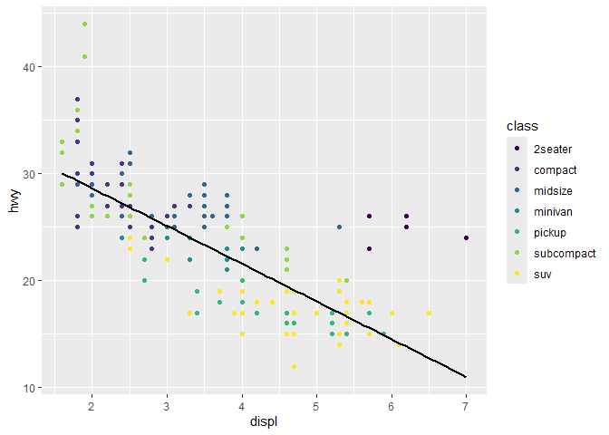

# Visualize Data
River Mckegney

## Create active Repository On Github: Here in Rstudio

> usethis::use_git()

‘There are \# uncommitted files:’ ‘! Is it ok to commit them?’
Selection: \# (Definitly) ‘Restart now?’ Selection: \# (Yes)

> usethis::use_github()

## Your Turn 0

Add a setup chunk that loads the tidyverse packages.

``` r
library(tidyverse)
```

    ── Attaching core tidyverse packages ──────────────────────── tidyverse 2.0.0 ──
    ✔ dplyr     1.1.4     ✔ readr     2.1.5
    ✔ forcats   1.0.0     ✔ stringr   1.5.1
    ✔ ggplot2   3.5.1     ✔ tibble    3.2.1
    ✔ lubridate 1.9.4     ✔ tidyr     1.3.1
    ✔ purrr     1.0.2     
    ── Conflicts ────────────────────────────────────────── tidyverse_conflicts() ──
    ✖ dplyr::filter() masks stats::filter()
    ✖ dplyr::lag()    masks stats::lag()
    ℹ Use the conflicted package (<http://conflicted.r-lib.org/>) to force all conflicts to become errors

``` r
# head() function creates a small display containing first and last data sections
head(mpg)
```

    # A tibble: 6 × 11
      manufacturer model displ  year   cyl trans      drv     cty   hwy fl    class 
      <chr>        <chr> <dbl> <int> <int> <chr>      <chr> <int> <int> <chr> <chr> 
    1 audi         a4      1.8  1999     4 auto(l5)   f        18    29 p     compa…
    2 audi         a4      1.8  1999     4 manual(m5) f        21    29 p     compa…
    3 audi         a4      2    2008     4 manual(m6) f        20    31 p     compa…
    4 audi         a4      2    2008     4 auto(av)   f        21    30 p     compa…
    5 audi         a4      2.8  1999     6 auto(l5)   f        16    26 p     compa…
    6 audi         a4      2.8  1999     6 manual(m5) f        18    26 p     compa…

## Your Turn 1

Run the code on the slide to make a graph. Pay strict attention to
spelling, capitalization, and parentheses!

``` r
ggplot(data = mpg) +
  geom_point(mapping = aes(x = displ, y = hwy))
```


## Your Turn 2

Replace this scatterplot with one that draws boxplots. Use the
cheatsheet. Try your best guess.

``` r
ggplot(data = mpg) +
  geom_point(mapping = aes(x = class, y = hwy))
```


``` r
ggplot(data = mpg) +
  geom_boxplot(mapping = aes(x = class, y = hwy))
```


## Your Turn 3

Make a histogram of the `hwy` variable from `mpg`. Hint: do not supply a
y variable.

``` r
ggplot(data = mpg) +
  geom_histogram(mapping = aes(x = hwy))
```

    `stat_bin()` using `bins = 30`. Pick better value with `binwidth`.


## Your Turn 4

Use the help page for `geom_histogram` to make the bins 2 units wide.

``` r
ggplot(data = mpg) +
  geom_histogram(mapping = aes(hwy), 
                 binwidth = 2)
```


## Your Turn 5

Add `color`, `size`, `alpha`, and `shape` aesthetics to your graph.
Experiment.

``` r
ggplot(data = mpg) +
  geom_point(mapping = aes(x = displ, y = hwy),
             size = 2,
             shape = 21,
             alpha = 0.5,
             color = "orange",
             fill = "blue"
             ) +
  labs(x = "Engine Displacement (L)",
       y = "Highway Miles Per Gallon", 
       title = "title")

ggplot(data = mpg) +
  geom_point(mapping = aes(x = displ, y = hwy, 
                           colour = class)) +
  labs(x = "Engine Displacement (L)",
       y = "Highway Miles Per Gallon", 
       color = "Vehicle Type",
       title = "Effect of Engine Size on MPG") +
  theme_light()
```

-1.png)

-2.png)

Aes adjustments to color, shape, alpha (transparency)

## Help Me

What do `facet_grid()` and `facet_wrap()` do? (run the code, interpret,
convince your group)

``` r
# Makes a plot that the commands below will modify
q <- ggplot(mpg) + geom_point(aes(x = displ, y = hwy))

# Generates an engine displacement vs highway mpg graph for each category of vehicle cylinder type. Graphs are stacked and value increments matched to a standard grid so comparisons can easily be made.
q + facet_grid(. ~ cyl) 

# Creates graph sub-types for each category of vehicle drive type (front- rear-, and 4-wheel drive)
q + facet_grid(drv ~ .)

# Splits graphs by vehicle drive type and cylinder size
q + facet_grid(drv ~ cyl)

# Makes unique graphs split by each car class. Axis value labels are placed or "wrapped" around the axis margins of outermost graphs
q + facet_wrap(~ class)

# Also splits graph by car class, but all graphs are symmetrically layed across the grid
q + facet_grid(~ class)
```


Facet_wrap and Facet_grid functions

## Your Turn 6

Make a bar chart `class` colored by `class`. Use the help page for
`geom_bar` to choose a “color” aesthetic for class.

``` r
# Use fill function
ggplot(data = mpg) +
geom_bar(mapping = aes(x = class, 
                       fill = class,
                       alpha = 0.5)) +
  labs(x = "Type Of Car", y = "Car Frequency")

# Use colour function
ggplot(data = mpg) +
geom_bar(mapping = aes(x = class, 
                       colour = class,
                       alpha = 0.5)) 

# Use fill, and remove legend with guides(fill = "none") outside aes
ggplot(data = mpg) +
geom_bar(mapping = aes(x = class, 
                       fill = class,
                       alpha = 0.5)) +
  labs(x = "Type Of Car", y = "Car Frequency") +
  guides(fill = "none") 

# Add another variable like drive within aesthetics
ggplot(data = mpg) +
  geom_bar(mapping = aes(x = class, 
                         fill = drv,
                         alpha = 0.5)) +
  labs(x = "Type Of Car", y = "Car Frequency") +
  guides(fill = "none") 

# Change position of stacked bar-plot with position function (outside aes, but within geom_bar), so instead of being on top of eachother they are paired side-by-side
  ggplot(data = mpg) +
  geom_bar(mapping = aes(x = class, 
                         fill = drv,
                         alpha = 0.5), 
           position = position_dodge()) +
  labs(x = "Type Of Car", y = "Car Frequency") +
  guides(fill = "none") 

# Colour function best for points and lines; fill function appropriate for bars and boxes!
```


colour for points or lines, fill for bars & boxes

Note: Class can be “double mapped” as a variable of two aesthetics. (ie.
aes(x = class, colour = class)) A single aesthetic function cannot be
applied to two different variables, but a single variable can be applied
many times to the same aesthetic function.

## Quiz

What will this code do?

``` r
ggplot(mpg) + 
  geom_point(aes(displ, hwy)) +
  geom_smooth(aes(displ, hwy)) 
```

    `geom_smooth()` using method = 'loess' and formula = 'y ~ x'


``` r
ggsave("example1.jpg")
```

    Saving 7 x 5 in image
    `geom_smooth()` using method = 'loess' and formula = 'y ~ x'

``` r
ggplot(mpg, aes(x = displ, y = hwy)) + 
  geom_point(aes(color = class)) + 
  geom_smooth(color = "black", # outside aes()
              se = FALSE, 
              method = "lm") +
  scale_color_viridis_d()
```

    `geom_smooth()` using formula = 'y ~ x'



``` r
ggsave("example2.jpg", width = 6, height = 4)
```

    `geom_smooth()` using formula = 'y ~ x'

The geom_smooth() function allows user to add another geometry over the
same graph. Adding aes(x =, y =) in the ggplot() applies this format to
the rest of the functions (embedded into everything else). This allows
the removal of aes() functions from the geometries functions. Additional
aes customizations can then be done with respect to each geometry.

Adding se = FALSE removes the standard error outline. The method
function changes what is being done to data like use of models.
scale_color functions add a pre-designed color scheme to the figure.

------------------------------------------------------------------------

# Take aways

You can use this code template to make thousands of graphs with
**ggplot2**.

``` r
ggplot(data = <DATA>) +
  <GEOM_FUNCTION>(mapping = aes(<MAPPINGS>))
```
